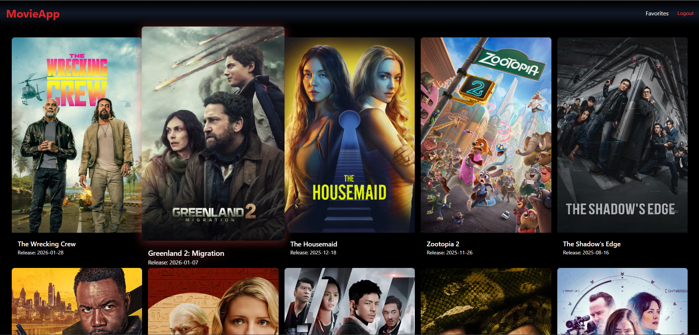
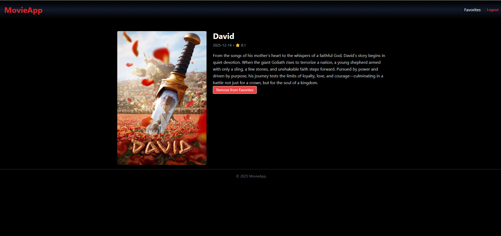

# 🎬 Movie World - Ultimate Cinema Discovery App


> **Movie World** is a modern, full-stack web application designed for cinema enthusiasts. It allows users to browse popular, top-rated, and upcoming movies, view detailed metadata, and manage a personalized, persistent list of favorites.

🔗 **Live Demo:** [https://oti404-movie-world.netlify.app/](https://oti404-movie-world.netlify.app/)

---

## 📑 Table of Contents
* [Screenshots](#-screenshots)
* [Features](#-features)
* [Tech Stack](#-tech-stack)
* [Project Structure](#-project-structure)
* [Getting Started](#-getting-started)
* [Database Schema](#-database-schema-supabase)
* [Authors](#-authors)

---

## 📸 Screenshots

| Home Page | Movie Details |
|:---------:|:-------------:|
|  |  |

*(Note: The app is fully responsive and optimized for Mobile, Tablet, and Desktop)*

---

## ✨ Features

* **🔥 Discover Movies:** Real-time data fetching for Popular, Top Rated, and Upcoming films.
* **🔍 Smart Search:** Instant search functionality powered by TMDB.
* **🔐 Secure Authentication:** Complete sign-up and login system using **Supabase Auth**.
* **❤️ Favorites System:**
    * **Add/Remove:** One-click toggle for favorite movies.
    * **Persistent Storage:** Data is saved in a PostgreSQL database, accessible across devices.
    * **Row Level Security (RLS):** Users can only access and modify their own data.
* **⚡ High Performance:** Server-Side Rendering (SSR) via **Nuxt 3** for SEO and speed.
* **🎨 Modern UI:** Styled with **Tailwind CSS** for a clean, dark-mode aesthetic.

---

## 🛠️ Tech Stack

* **Framework:** [Nuxt 3](https://nuxt.com/) (Vue.js)
* **Language:** TypeScript
* **Styling:** [Tailwind CSS](https://tailwindcss.com/)
* **Backend & Database:** [Supabase](https://supabase.com/) (PostgreSQL + Auth)
* **Data Source:** [The Movie Database (TMDB) API](https://www.themoviedb.org/)
* **Deployment:** [Netlify](https://www.netlify.com/) (Edge Functions)

---

## 📂 Project Structure

A brief overview of the project's architecture:

```bash
├── components/       # Reusable Vue components (MovieCard, Navbar, etc.)
├── pages/            # Application routes (Home, Login, Movie Details)
├── server/
│   └── api/          # Server-side API routes (hides API keys)
│       ├── movies.ts # Fetches data from TMDB
│       └── favorites # Handles Database CRUD operations
├── public/           # Static assets
└── nuxt.config.ts    # Main configuration file
```
🚀 Getting Started
Follow these steps to run the project locally.

1. Clone the repository
```Bash
git clone [https://github.com/Oti404/movie_world.git](https://github.com/Oti404/movie_world.git)
cd movie_world
```
2. Install dependencies
```Bash
npm install
```
3. Environment Variables
Create a .env file in the root directory. You will need API keys from TMDB and Supabase.

Code snippet
# Nuxt Settings
```
NUXT_PUBLIC_BASE_URL="http://localhost:3000/"

# TMDB Settings (Get key from themoviedb.org)
TMDB_API_KEY="your_tmdb_api_key_here"
TMDB_API_URL="[https://api.themoviedb.org/3/](https://api.themoviedb.org/3/)"

# Supabase Settings (Get from supabase.com)
SUPABASE_URL="your_supabase_project_url"
SUPABASE_KEY="your_supabase_anon_key"
```
4. Run the development server
```Bash
npm run dev
```
Visit http://localhost:3000 to see the app in action.

🗄️ Database Schema (Supabase)
This project uses a relational PostgreSQL database. The favorites table includes a JSONB column to cache movie details, reducing API calls.

SQL Query to create the table:

```SQL
create table public.favorites (
  id bigint generated by default as identity primary key,
  user_id uuid references auth.users not null,
  movie_id bigint not null,
  title text,
  poster_path text,
  overview text,
  vote_average numeric,
  release_date text,
  movie_data jsonb,
  created_at timestamp with time zone default timezone('utc'::text, now()) not null
);
```
🤝 Contributing
Contributions are what make the open source community such an amazing place to learn, inspire, and create. Any contributions you make are greatly appreciated.

Fork the Project

Create your Feature Branch (git checkout -b feature/AmazingFeature)

Commit your Changes (git commit -m 'Add some AmazingFeature')

Push to the Branch (git push origin feature/AmazingFeature)

Open a Pull Request

👥 Authors

Oti404 - Lead Developer - GitHub Profile

Vlad Priscu - Contributor/Original Repo - GitHub Profile

⚠️ Acknowledgments
This product uses the TMDB API but is not endorsed or certified by TMDB.

⭐ If you like this project, please give it a Star!
